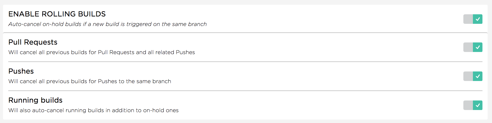
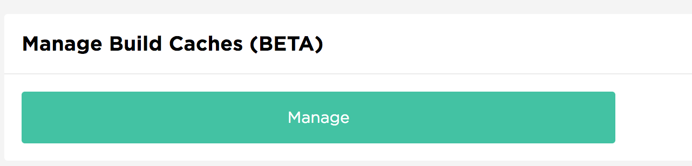
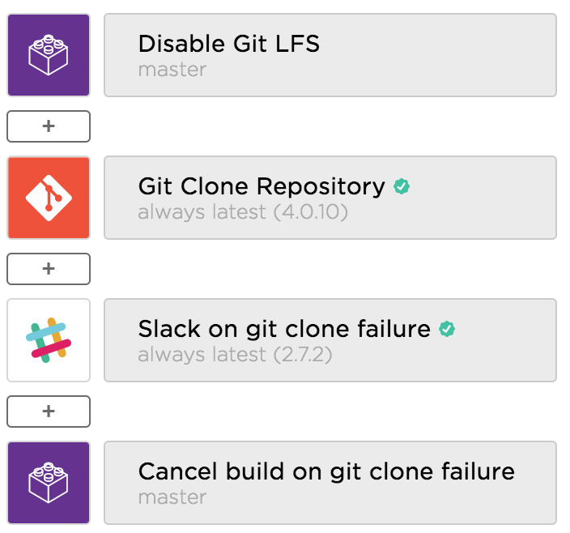

# Bitrise

Bitrise is used to run jobs for four teams (Practice, Android, iOS, QA).
Optimal job configurations ensure we have enough resources for everyone.

# Job Settings

## Rolling Builds

Rolling builds enables auto cancelling stale builds when new builds are created.

## Build Caches

The build caches grow infinitely. It's good to clear out the caches over time. When there's a build failure, try clearing the cache and making a new build.

## Git Clone Workflow

Instructure uses open source steps to optimize Git clone performance and stability:

- [Disable git lfs](https://github.com/instructure/steps-disable-git-lfs)
- [Selective builds](https://github.com/instructure/steps-selective-builds)
- [Cancel build](https://github.com/instructure/steps-cancel-build)

All jobs should:

- Disable Git LFS before cloning
    - This avoids wasting Git LFS bandwidth downloading jars we don't need
- Cancel build on git clone failure
  - Build performance is improved when we cancel on failure
  - Canceled builds don't count as build errors which is helpful for reporting

If a job is running on pull requests, ensure that some form of Selective Builds is configured. Otherwise that job will run on every change, even if we only changed a readme file.

