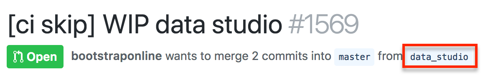

# Mobile Team Git Workflow

This document contains instructions to perform basic git operations in the Mobile team.

## Prerequisites
* Install [Homebrew](https://brew.sh/)
* Install the latest git using Homebrew: `brew install git`. 
    * If git was already installed using Homebrew, upgrade: `brew upgrade git`
* Set some global configurations:

```sh
git config --global push.default current
git config --global pull.rebase true
```
## Workflow

* Optionally use [Visual Studio Code](https://code.visualstudio.com) as the default editor

  - In Visual Studio Code, open the Command Palette (⇧⌘P) and type `shell command`. Click `Shell Command: Install 'code' command in PATH`
  - Run `git config --global core.editor "code --wait"`

* Define a git fixup alias in `~/.gitconfig`. Git fixup will meld changed files into the previous commit.

```sh
[alias]
    f = "!sh -c '(git add . ; git commit --amend -C HEAD)' -"
```

### Git LFS
[Git LFS](https://git-lfs.github.com/) is used for data seeding. Make sure to use the latest stable version of Git (not system git). Install [JDK 1.8 from Oracle (not 1.9).](http://www.oracle.com/technetwork/java/javase/downloads/jdk8-downloads-2133151.html)

- `brew install git-lfs`
- `git lfs install`
- `git lfs pull`

### Things to know about gitignore
* Git automatically tracks all the changes in an initialized local git directory and subdirectories.
  A [.gitignore](https://git-scm.com/docs/gitignore) file is used to tell git which directories/files it should ignore while tracking changes.

## Create a remote branch and push a commit to GitHub
* Create a local code branch. Usually, the name branch is the same as the JIRA ID. Let us say, MBL-123.

```sh
git checkout -b MBL-123
```
* Change the code. Compare the differences by running [git diff](https://stackoverflow.com/a/3686507) or using [GitHub Desktop](https://desktop.github.com/)
```sh
git diff
```

* Add all changed files (excluding ignored) by running:
```sh
git add .
```

* Create a local commit.

```sh
git commit -am 'Add feature foobar'
```
* Push it to the remote branch on Github.

```sh
git push
```

#### Rebase local commits on to upstream changes

```sh
git pull origin master
```
    
## Push new changes to a remote branch
* Make code changes locally. 
* Run the following commands:

```sh
git f
git push -f
```

Note that the `f` alias adds all untracked and modified files to the local commit.
Alternatively, add files manually and then amend the local commit by running `git commit --amend -C HEAD`

## Squash all commits on a branch into one
* Count how many commits exist on the pull request (or branch). Let us say, 10.
* Run:

```sh
git reset --soft head~10
git commit -am 'Add feature foobar'
git push -f
```

## Squashing with multiple authors

When there are multiple authors, `git rebase -i head~10` allows precise control over how the commits are squashed.
Typically, one commit per author is desired.

## Checkout a pull request
* Find out which branch is associated with the pull request. 
   * Open the GitHub pull request webpage in a browser
   * Get the branch name:
   
* Run the following commands:

```sh
git fetch origin
git checkout <branch_name>
```

## Push changes to a pull request
* Pull down the pull request as described above
* Make code changes. 
* Create a separate commit by running the following commands:

```sh
git commit -am 'Add feature foobar'
git push
```
Note that force pushing `git push -f` will cause merge conflicts for other users working on the pull request.
