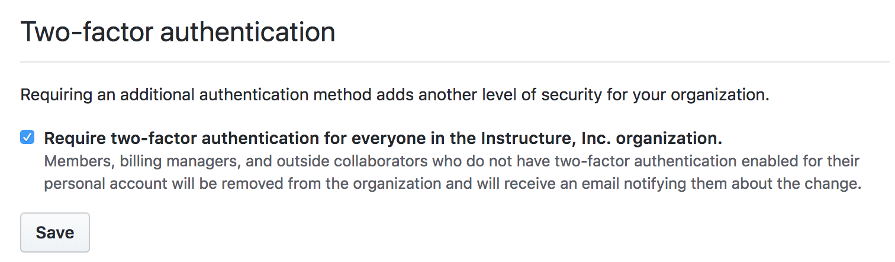
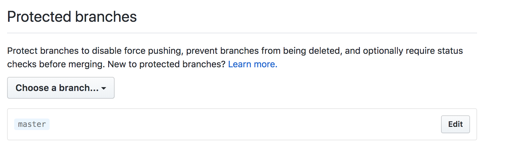
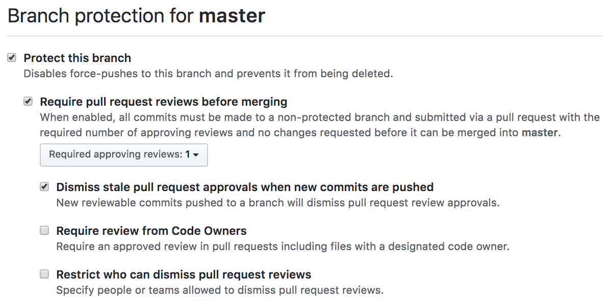
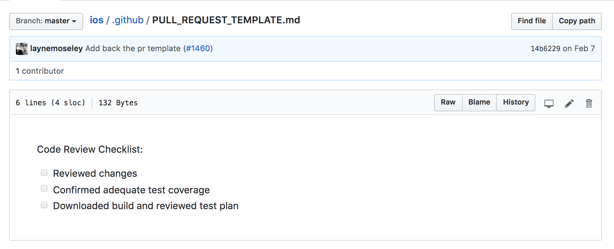
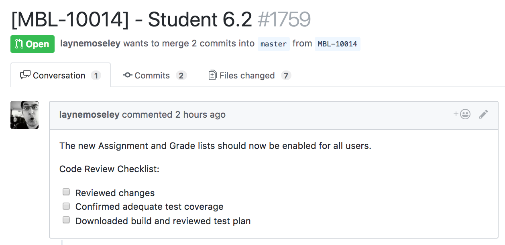
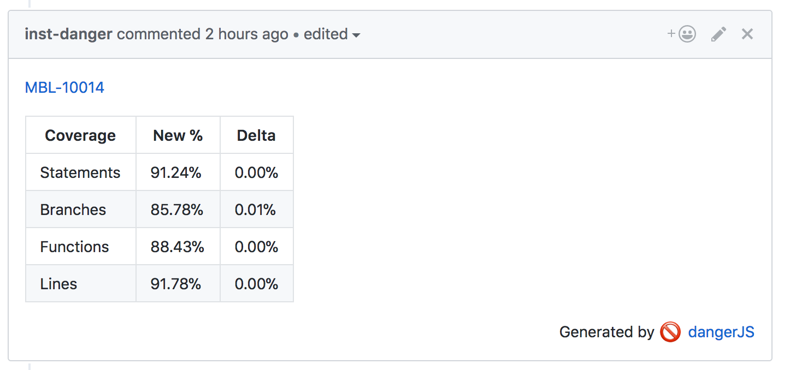

# GitHub

The mobile teams are using GitHub to collaborate on source code. This document describes some general best practices that are being used by the iOS and Android teams.

## Security

The Instructure GitHub org is configured to enforce 2FA on all accounts. Users who disable 2FA are automatically removed.

## SOC-2 compliance

Protected branches are used to enforce code review and disable force pushing. Required status checks may be used to enforce that status checks pass. A status check is any 3rd party tool such as a build server or a CLA bot.

## Merging

Mobile has removed merge commits. Only squash merging or rebase merging are allowed. This helps ensure a clean git history.

## Pull Request Templates

A pull request template is used to ensure code is properly checked before merging.

## Pull Request Bots

Danger is used to automate linting and code coverage reporting.

- [Danger on bitrise](https://blog.bitrise.io/danger-danger-uh-that-is-using-danger-with-bitrise)
- [Danger on buddybuild](https://www.buddybuild.com/blog/using-danger-ci-with-buddybuild)

